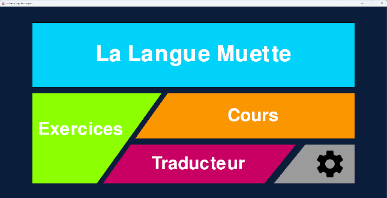
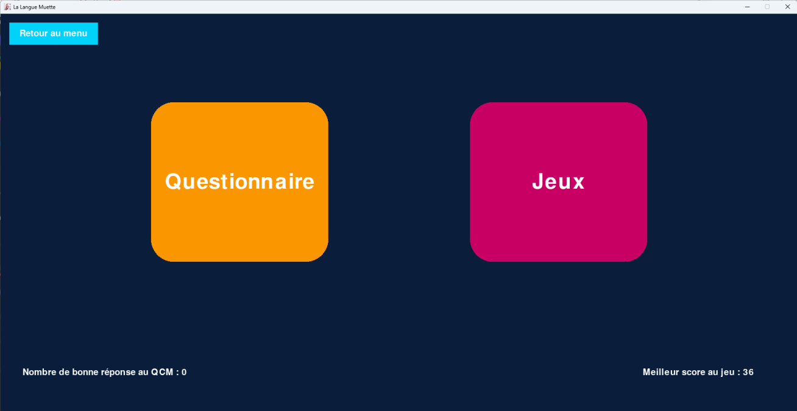
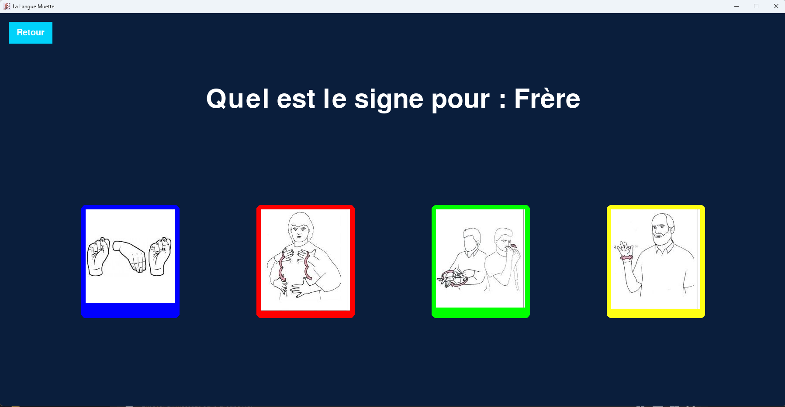
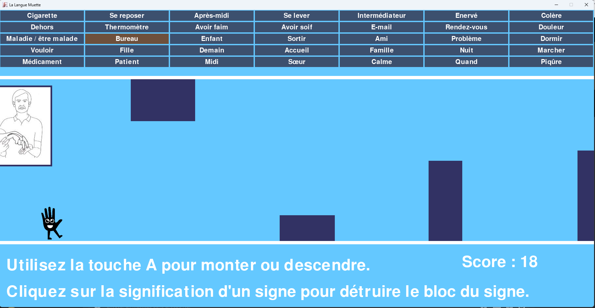
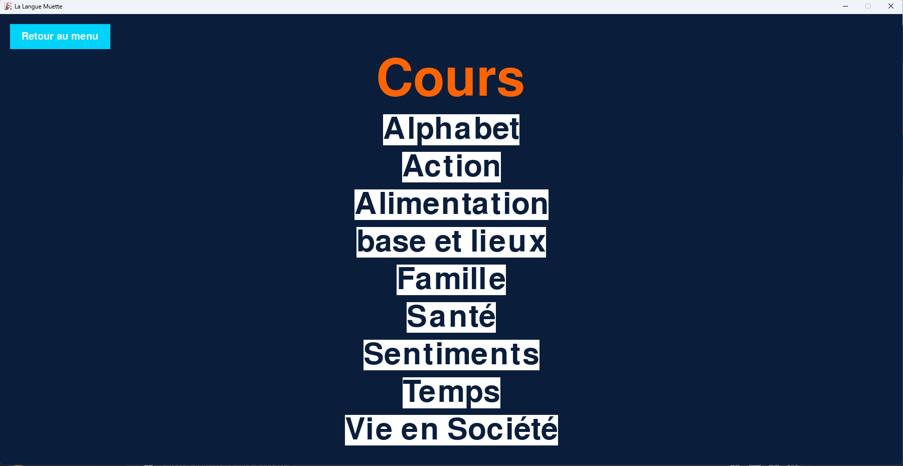
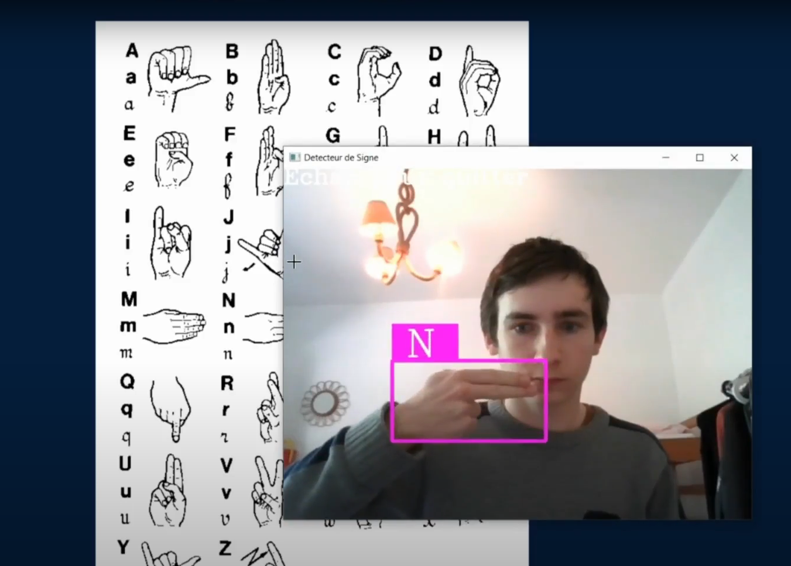
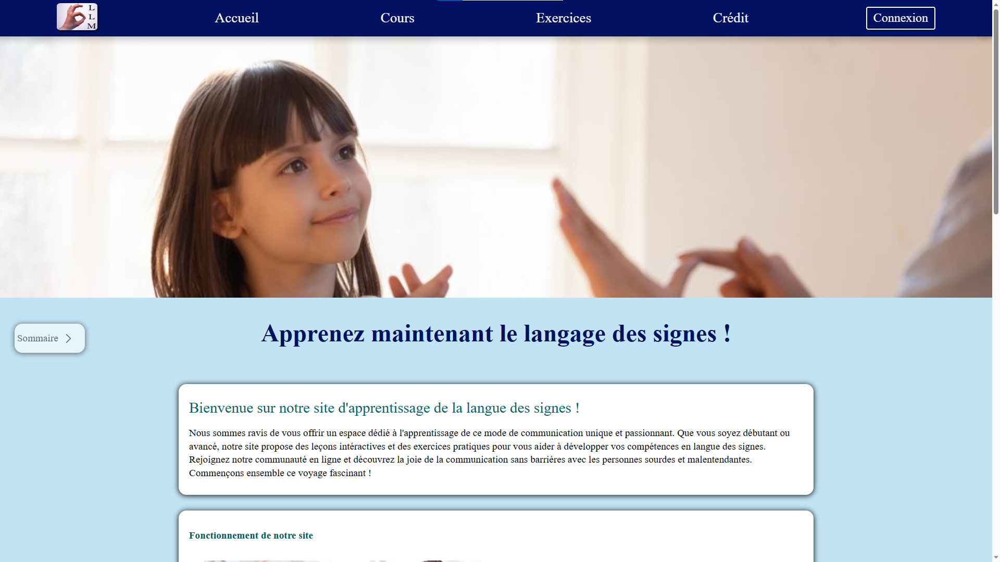

---
<h1>LaLangueMuette(LLM)</h1>
Ce projet a été crée par <a href="https://github.com/XiNoxZz">Mathis</a>, <a href="https://github.com/Skavengers">François</a> et <a href="https://github.com/AymericdeCau">Aymeric</a>

Le fichier main est le fichier principale.
Le fichiers tools contient les class et les fonctions utilisés dans tout le projet.
Le fichier course contient le code lié à la page cours de l'application, il est de même pour practice.py, hand_detector.py et settings.py.
Les images utilisées dans cours sont stokés dans assets/picturesforcourse.
Les images utilisées dans home sont stokés dans assets/picturesforhome.
Et les images utilisées dans pratice sont stokés dans assets/picturesforgame.
(Les images utilisées pour ce README sont stokés dans assets/picturesforREADME.)

---
<h1>Caractéristiques de l'application</h1>

Notre application est composé de 4 boutons :
    
   - Exercices
   - Cours 
   - Traducteur
   - Réglages
    
 

---
<h1>Exercices</h1>

    
La partie exercice est composé de deux parties, la partie questionnaire et la partie jeu.
---

<h2>Questionnaire</h2>

<h3>Le questionnaire vous permet de vous testez sur vos connaissances, l'utilisateur doit trouvé le signe correspondant à un mot, si il trouve la bonne réponse, on le félicite sinon on lui donne le signe correct.</h3>

---

<h2>Jeu</h2>

En jouant à notre jeu vous incarnez notre mascotte, Bobov, qui doit trouver le nom de l'image qui s'affiche et qui doit esquiver les blocs pour gagner.

---

<h1>Cours</h1>

La partie cours vous permet d'apprendre les mots usuels. Chaque fiche de cours est classée par catégorie.

---

<h1>Traducteur</h1>

Le traducteur vous permet, à l'aide d'une caméra, de detecter les signes que vous faites.

---

<h1>Réglages</h1>

La partie réglages permet de changer les fps (images par seconde) de votre jeu.

---

<h1>Site Internet de l'application</h1>

Notre site internet est composé de trois grandes parties que sont l'accueil, le cours et les exercices. Avec la partie cours, vous pouvez apprendre l'alphabet ou des mots de la langue des signes. Quant à elle, la partie exercice vous permet de répondre à des QCM sur les différents signes qui vous sont proposés dans la partie cours.
Le fichier index.html correspond a la page d'accueil du site web.

---

<h1>Prérequis pour utiliser notre application</h1>

Pour utiliser notre application, il vous faut python ainsi que les modules python pygame (affichage graphique), opencv-python (détecteur de main et traitement de l’image), médiapipe (obtentioon du résultat de la webcam), tensor flow (création de l’IA détectant les signes), cv zone (permet de compresser et d’utiliser l’IA) et enfin numpy (qui permet de créer une image blanche de 300px sur 300px ou s’ajoute l’image de la
webcam). Si vous ne voulez pas installé les 5 derniers modules, vous ne pourrez pas utiliser la caméra mais vous pourez tout de même testé l'application en commentant la ligne 8 de main.py.

---

<h1>Licence</h1>

Ce document est sous licence Creative Commons CC BY-SA 4.0 : https://creativecommons.org/licenses/by-sa/4.0/

